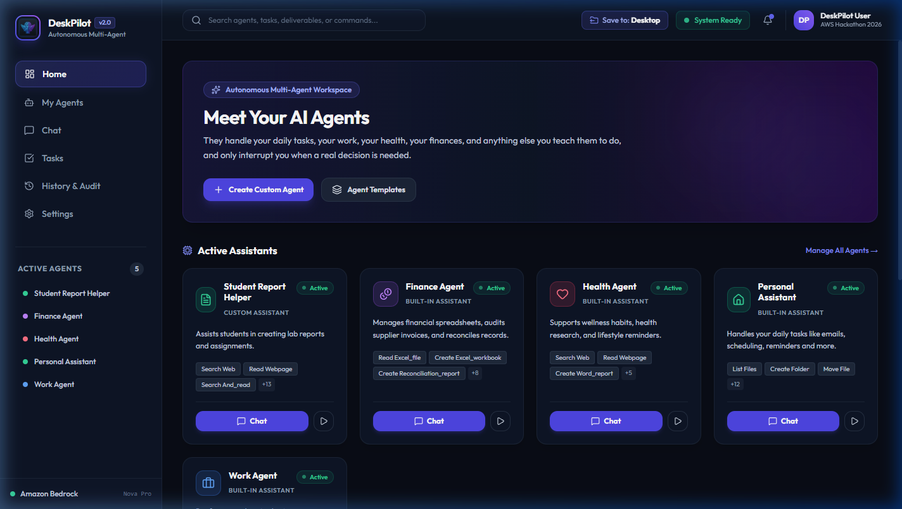
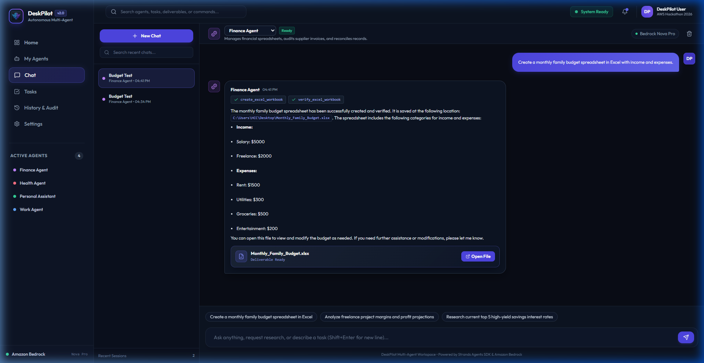
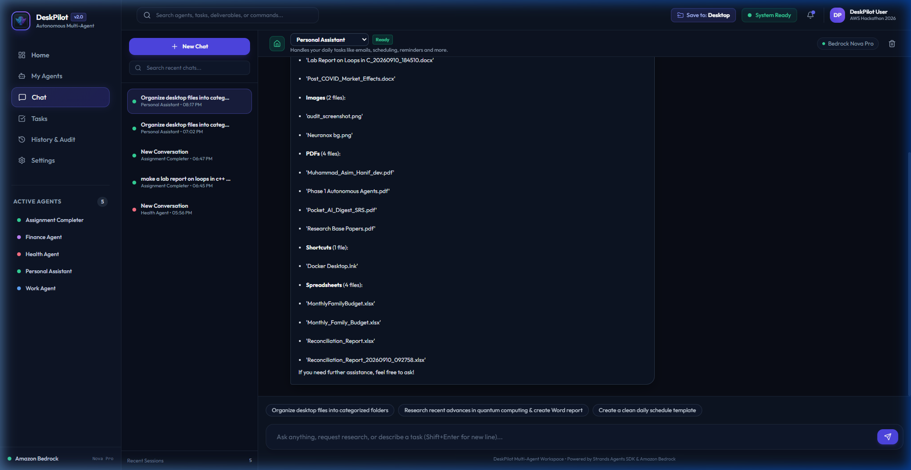
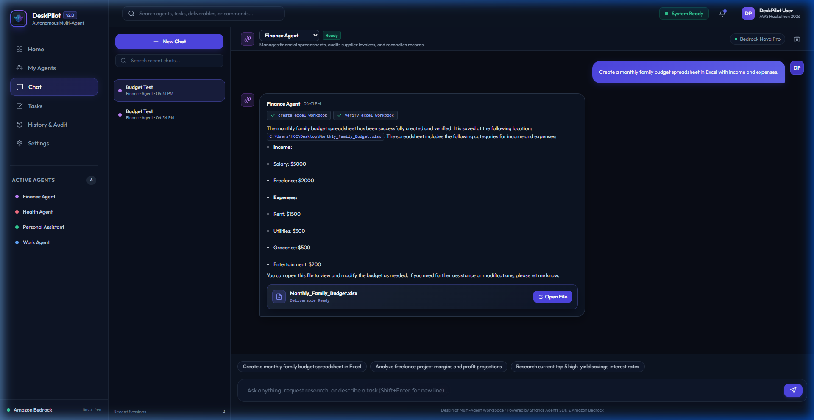
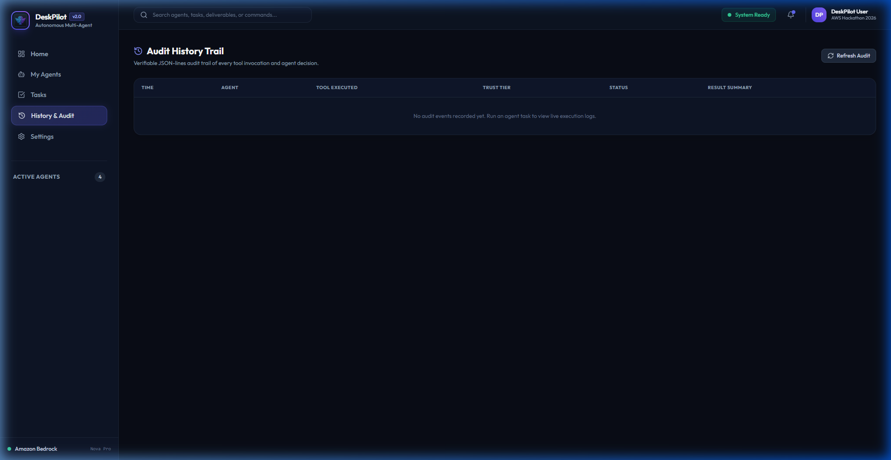
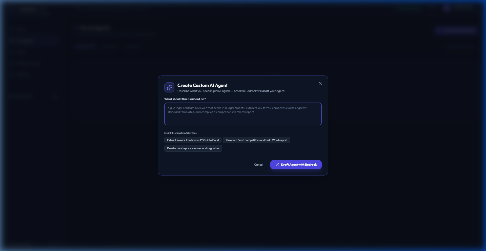
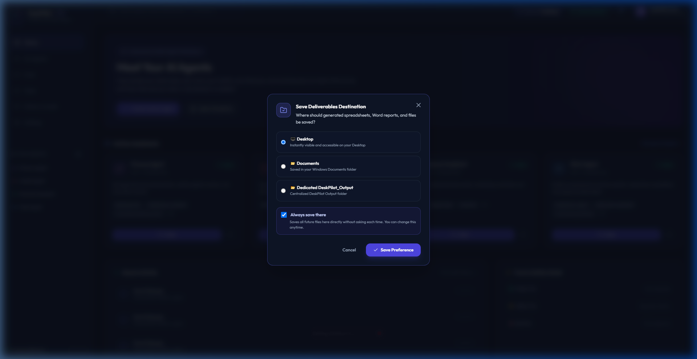
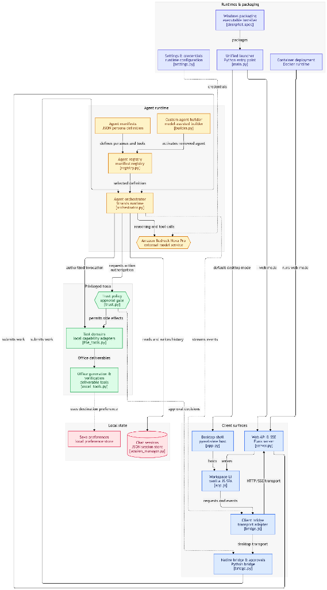

# DeskPilot — Multi-Agent Windows Desktop Assistant

[](https://aws.amazon.com/)
[](https://aws.amazon.com/bedrock/)
[](https://github.com/strands-agents)
[](https://pywebview.flowrl.com/)
[](https://www.docker.com/)
[](LICENSE)

> **"Meet your autonomous desktop co-pilots — they manage your files, draft executive reports, build verified financial spreadsheets, perform deep research, and keep your workspace clean, interrupting you only when a genuine human decision is required."**



Built specifically for the **AWS "Agents for Humans" Hackathon (Professional Agents Track)**, **DeskPilot** is a production-grade multi-agent autonomous desktop workspace. Powered by **Amazon Bedrock Nova Pro** (`amazon.nova-pro-v1:0`) and the **Strands Agents SDK**, DeskPilot unites cutting-edge agentic reasoning with local desktop automation, verifiable document generation, and a 3-tier Human-in-the-Loop safety architecture.

---

## 🌟 What DeskPilot Can Do (Core Capabilities)

### 1. 💬 Modern Multi-Turn Conversational Workspace (ChatGPT / Gemini Style)
- **Multi-Turn Chat Sessions**: Persistent, JSON-backed conversation history with automated intelligent titling based on conversational intent.
- **Real-Time Streaming**: Token-by-token text streaming paired with live tool execution step badges (e.g. `🔧 organize_files (running)...`).
- **Collapsible Reasoning**: Amazon Bedrock Nova Pro `<thinking>...</thinking>` reasoning tokens are automatically rendered into sleek, collapsible accordions (`🧠 Agent Reasoning & Thought Process`).
- **Glassmorphism Markdown Tables**: Renders comparison tables and financial data with rich alternating colors and modern styling.
- **Deliverable Action Cards**: Deliverables (`.docx`, `.xlsx`, `.pdf`) generated by agents display as clickable badges with one-click "Open File" buttons.



### 2. 📁 Autonomous Desktop Organization (`@tool organize_files`)
- **One-Click Batch Categorization**: Scans loose files on the Desktop (or any directory) and automatically categorizes them into organized subfolders:
  - 📄 **Documents**: `.docx`, `.txt`, `.rtf`, `.odt`, `.md`
  - 📊 **Spreadsheets**: `.xlsx`, `.xls`, `.csv`, `.tsv`
  - 📑 **PDFs**: `.pdf`
  - 🖼️ **Images**: `.png`, `.jpg`, `.jpeg`, `.gif`, `.webp`, `.svg`
  - 📽️ **Presentations**: `.pptx`, `.ppt`
  - 💻 **Code**: `.py`, `.js`, `.ts`, `.html`, `.css`, `.json`, `.sql`
  - 🔗 **Shortcuts**: `.lnk`, `.url`
  - 📦 **Archives**: `.zip`, `.rar`, `.7z`, `.tar`
- **Unified Single Approval**: Eliminates confirmation spam by asking for approval **once** for the entire batch rather than prompting for every single file.
- **Safe Execution**: Preserves system files (`desktop.ini`), handles temporary file locks with retries, and avoids naming collisions.



### 3. 📝 Executive Document & Spreadsheet Generation
- **Microsoft Word Reports (`create_word_report`)**: Creates polished `.docx` reports with hierarchical headings, bullet points, callout boxes, and formatted tables.
- **Microsoft Excel Workbooks (`create_excel_workbook`)**: Creates formatted `.xlsx` workbooks with:
  - Real numeric types (`int`/`float`) for mathematical accuracy.
  - Proper currency and percentage formatting.
  - Working native Excel formulas (e.g. `=SUM(B2:B10)`).
  - Styled headers and auto-fitted columns.
- **Automated Self-Verification**: Immediately validates generated files on disk via `verify_word_document` and `verify_excel_workbook` before presenting them to the user.



### 4. 🛡️ 3-Tier Human-in-the-Loop Trust Engine (Trust & Safety Model)
Enforces strict autonomy boundaries across all tools:
- 🟢 **Green (Autonomous)**: Read-only sweeps, research, document creation.
- 🟡 **Yellow (Confirmation Required)**: Moving, renaming, or batch organizing files. Features an **"Approve All"** button for uninterrupted batch workflows.
- 🔴 **Red (Unbypassable Approval)**: Permanent deletions and system software installations strictly checked against an explicit `WINGET_ALLOWLIST`.



### 5. 🪄 Natural-Language Custom Agent Builder
- Describe any desired workflow in natural language (e.g. *"Commercial Real Estate Agent analyzing office leases and tracking properties in Excel"*).
- Amazon Bedrock synthesizes the persona, selects an authorized tool subset, and presents a human-readable draft for review before activation.



### 6. 💾 Dynamic Save Preferences ("Always save there")
- Select preferred save destinations (Desktop, Documents, or Custom Folder) directly from the top navigation bar.
- Includes an **"Always save there"** setting that persists across sessions in `save_preferences.json`.



---

## ⚡ Powered by Amazon Bedrock

DeskPilot is engineered from the ground up around **Amazon Web Services (AWS)** foundation model infrastructure:

| AWS Component | Role in DeskPilot | Why It Matters |
|---|---|---|
| **Amazon Nova Pro** (`amazon.nova-pro-v1:0`) | Primary Reasoning & Tool Calling Brain | Exceptional speed, cost efficiency, multimodal reasoning, and high tool-calling determinism. |
| **Amazon Bedrock Converse API** | Streaming & Tool Orchestration | Native schema adherence, zero hallucinated tool names, and low-latency token streaming. |
| **Strands Agents SDK** | Dynamic Agent Runtime | Decoupled agent lifecycle, stateful multi-turn history, and modular tool registration. |
| **Flexible Authentication** | Enterprise & Developer Friendly | Supports both direct Bedrock API Keys (`BEDROCK_API_KEY`) and standard IAM Access Keys (`AWS_ACCESS_KEY_ID`). |

---

## 🏗️ System Architecture


<details open>
<summary><b>🔍 Click to expand: Detailed Component & Runtime Interaction Architecture</b></summary>



</details>

For detailed component interaction diagrams and technical breakdowns, see [docs/ARCHITECTURE.md](docs/ARCHITECTURE.md).

---

## 👥 Built-in Agents Fleet

| Agent | Purpose | Key Tools |
|---|---|---|
| **Personal Assistant** | Daily tasks, schedule management, desktop organization | `organize_files`, `list_files`, `create_folder`, `move_file`, `search_web`, `create_word_report` |
| **Finance Agent** | Expense tracking, ledger reconciliation, budget modeling | `create_excel_workbook`, `verify_excel_workbook`, `read_excel_file`, `extract_pdf_invoice`, `search_web` |
| **Work Agent** | Deep research, executive briefs, multi-page business reports | `create_word_report`, `verify_word_document`, `create_excel_workbook`, `read_pdf`, `extract_pdf_tables`, `search_web` |
| **Health Agent** | Meal planning, fitness routines, wellness research *(no-diagnosis safety prompt)* | `search_web`, `read_webpage`, `create_word_report` |

---

## 🚀 Quickstart & Deployment Options

### Option 1: Native Windows Desktop App (WebView2)
```bash
# Clone and setup environment
git clone https://github.com/your-repo/deskpilot.git
cd deskpilot
python -m venv venv
venv\Scripts\activate
pip install -r requirements.txt

# Configure your AWS Bedrock credentials
cp .env.example .env
# Edit .env and enter BEDROCK_API_KEY or AWS_ACCESS_KEY_ID

# Launch native desktop application
python main.py
```

### Option 2: Browser Web Mode
```bash
python main.py --web
# Opens automatically at http://localhost:5000
```

### Option 3: Docker & Docker Compose
```bash
# Configure .env with AWS keys
cp .env.example .env

# Run containerized workspace
docker compose up -d

# Access web workspace at http://localhost:5000
```

### Option 4: Standalone Windows Executable (.exe) & Packaging & Building the Installer
```bat
scripts\build.bat
```
Generates a standalone portable executable at `dist\DeskPilot\DeskPilot.exe` and an Inno Setup installer at `dist\installer\`.

### Option 5: AWS Cloud Deployment (App Runner / ECS / EC2)
For step-by-step instructions on deploying DeskPilot to **AWS App Runner**, **AWS ECS Fargate**, or **Amazon EC2**, refer to the [docs/DEPLOYMENT.md](file:///g:/Hackathon/AWS%20Hackathon%20Project/Project/docs/DEPLOYMENT.md) guide.

---

## 🧪 Automated Testing

DeskPilot includes a comprehensive automated test suite validating tool parsing, document generation, trust caching, and live agent invocations:

```bash
# Run unit & integration test suites
python -m pytest tests/test_organize_files.py tests/test_robust_tools.py tests/test_phase2.py tests/test_chat_sessions.py -v
```

---

## 📂 Project Structure

```
DeskPilot/
├── agents/                  # Declarative JSON agent manifests
│   ├── personal_assistant.json
│   ├── finance_agent.json
│   ├── work_agent.json
│   └── health_agent.json
├── assets/                  # Application branding, icons, and logos
├── backend/                 # Python 3.12 Core Backend
│   ├── agent/               # Strands Orchestrator, Builder, Registry
│   ├── chat/                # Persistent Chat Session Manager
│   ├── config/              # Central settings and Trust Action classifications
│   ├── tools/               # 28 Autonomous tools (Word, Excel, Files, Web, PDF)
│   ├── utils/               # Trust Tier HITL Engine, Save Preferences, Logger
│   ├── app.py               # pywebview WebView2 Desktop Entrypoint
│   ├── bridge.py            # JavaScript ↔ Python API Bridge
│   └── server.py            # Local Flask REST API & SSE Event Stream
├── docs/                    # Technical Architecture & Deployment Guides
│   ├── ARCHITECTURE.md      # In-depth architectural specifications
│   └── DEPLOYMENT.md        # Multi-environment deployment manual
├── frontend/                # Presentation Layer (HTML5, Vanilla CSS, JS)
│   ├── css/styles.css       # Dark glassmorphism theme and animations
│   ├── js/app.js            # Workspace controller and chat streaming
│   ├── js/bridge.js         # Unified bridge client (pywebview & HTTP)
│   └── index.html           # Single-page application shell
├── installer/               # Inno Setup 6 packaging script (.iss)
├── sample_data/             # Test invoices and ledger spreadsheets
├── scripts/                 # Windows build pipelines (.bat and .ps1)
├── tests/                   # Automated pytest suite
├── .env.example             # Clean AWS Bedrock environment template
├── .gitignore               # Comprehensive Git ignore rules
├── Dockerfile               # Production Docker container definition
├── docker-compose.yml       # Docker Compose orchestration
└── main.py                  # Root unified application launcher
```

---

## 📜 License & Acknowledgments

- **License**: MIT License ([LICENSE](LICENSE))
- **AWS Hackathon**: Developed for the **AWS "Agents for Humans" Hackathon (2026)**.
- **Powered by**: [Amazon Bedrock](https://aws.amazon.com/bedrock/) and [Strands Agents SDK](https://github.com/strands-agents).
