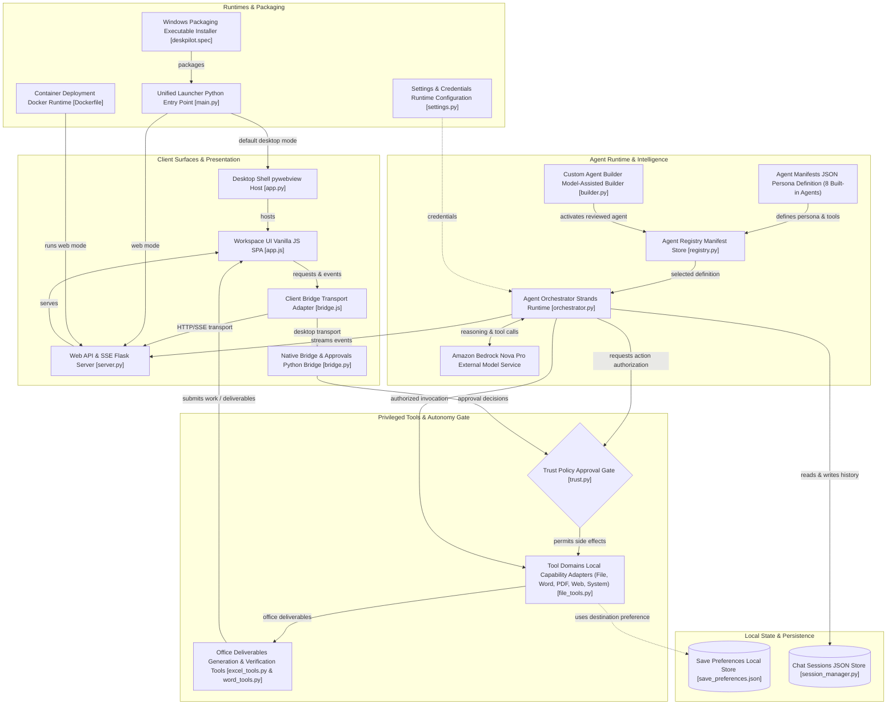
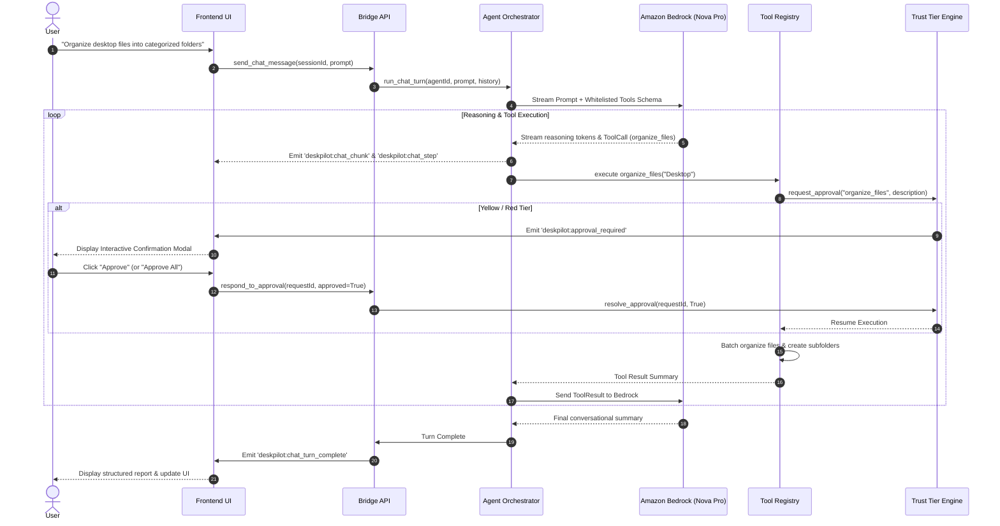
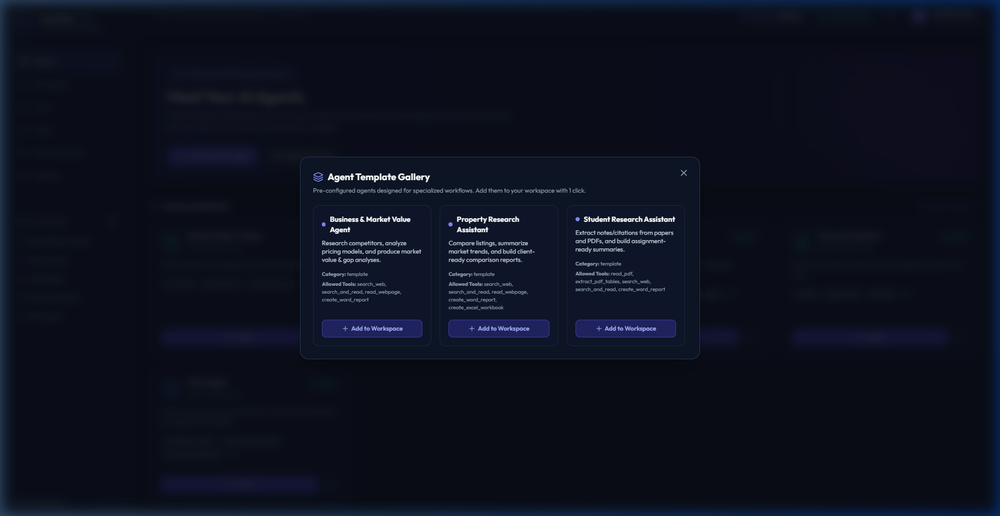

# DeskPilot Technical Architecture

[](https://aws.amazon.com/bedrock/)
[](https://github.com/strands-agents)
[](https://pywebview.flowrl.com/)

This document details the internal architecture, component interactions, safety mechanisms, and Amazon Bedrock integration powering **DeskPilot**.


---

## 1. System Overview

DeskPilot is architected around a **decoupled hybrid desktop model**:
- **Presentation Layer**: A high-performance, dark glassmorphism interface running inside Microsoft Edge WebView2 (via `pywebview`) or served locally via Flask for standard browsers.
- **Bridge Layer**: A two-way event bus bridging JavaScript UI actions to Python threads via native pywebview bindings and Server-Sent Events (SSE).
- **Agent Orchestration Engine**: Built with the **Strands Agents SDK**, dynamically instantiating agents backed by **Amazon Bedrock Nova Pro** (`amazon.nova-pro-v1:0`).
- **Trust & Autonomy Engine**: A stateful Human-in-the-Loop approval gate categorizing all agent actions into **Green**, **Yellow**, or **Red** tiers.
- **Tool Execution Framework**: 28 native desktop tools covering file management, Word/Excel document creation, PDF analysis, web research, and system software installations.



---

## 2. Agent Orchestration & AWS Bedrock Integration

DeskPilot leverages the **Strands Agents SDK** combined with **Amazon Bedrock** for high-speed agentic reasoning and deterministic tool invocation.



---

## 3. Human-in-the-Loop Trust Model

Every action executed by an agent is evaluated by the **Trust Tier Classifier** (`backend/utils/trust.py`):

| Trust Tier | Behavioral Model | Example Tools | User Experience |
|---|---|---|---|
| **🟢 Green (Autonomous)** | Auto-executed without human interruption | `list_files`, `verify_file_exists`, `read_file`, `create_folder`, `create_word_report`, `create_excel_workbook`, `search_web` | Immediate execution with pulsing tool badges in chat |
| **🟡 Yellow (Confirmation Required)** | Thread pauses; requires user confirmation | `move_file`, `rename_file`, `organize_files`, `write_file` | Modal popup with action description. Supports **Approve All** for batch operations |
| **🔴 Red (Unbypassable Approval)** | Mandatory explicit approval; strict allowlists | `delete_file`, `install_software`, `run_shell_command` | High-visibility warning dialog with full path/package verification |

### "Approve All" Batch Caching
In batch operations (e.g., reorganizing multiple files or multi-document workflows), DeskPilot implements **Session-Scoped Approval Caching**:
1. When a user clicks **Approve All** on an approval modal, the approval engine caches authorization for that specific action type.
2. Subsequent calls of the same action type within that turn execute immediately without modal interruptions.
3. The cache automatically clears at the start of every new chat turn.


---

## 4. Multi-Agent Registry Architecture

Agents are defined as lightweight, declarative JSON manifests stored in `agents/`:

```json
{
  "id": "personal_assistant",
  "name": "Personal Assistant",
  "description": "Handles daily tasks like desktop cleanup, file organization, and light research.",
  "icon": "home",
  "color": "green",
  "persona": "System prompt guardrails and behavioral guidelines...",
  "allowed_tools": [
    "list_files",
    "create_folder",
    "move_file",
    "organize_files",
    "create_word_report",
    "create_excel_workbook"
  ],
  "category": "default",
  "status": "active"
}
```



### Strict Tool Whitelisting (Section 13 Compliance)
When an agent is loaded, `AgentOrchestrator.build_agent()` strictly resolves only the tools listed in `allowed_tools`. Tools outside the whitelist are never exposed to the foundation model, preventing unauthorized capabilities or hallucinated tool use.

---

## 5. Deliverable Pipeline & Self-Verification

When generating documents, DeskPilot enforces a closed-loop creation and verification lifecycle:

```
[User Request] 
      │
      ▼
[Tool: create_excel_workbook] ──► Writes formulas, formats currency, auto-fits columns
      │
      ▼
[Tool: verify_excel_workbook] ──► Inspects workbook using openpyxl, validates data and formulas
      │
      ▼
[Deliverable Card in Chat]    ──► Renders clickable deliverable chip with one-click "Open File"
```

1. **Excel Workbooks**: Numeric cells are cast to real numbers (`int`/`float`), formulas like `=SUM(B2:B10)` are inserted natively, and headers are styled with theme fills.
2. **Word Reports**: Markdown headers, lists, and tables are converted into native Microsoft Word headings, bullet points, and styled tables.
3. **Save Preferences**: All deliverables respect the user's active save location (Desktop, Documents, or Custom) configured via the top navigation bar.
