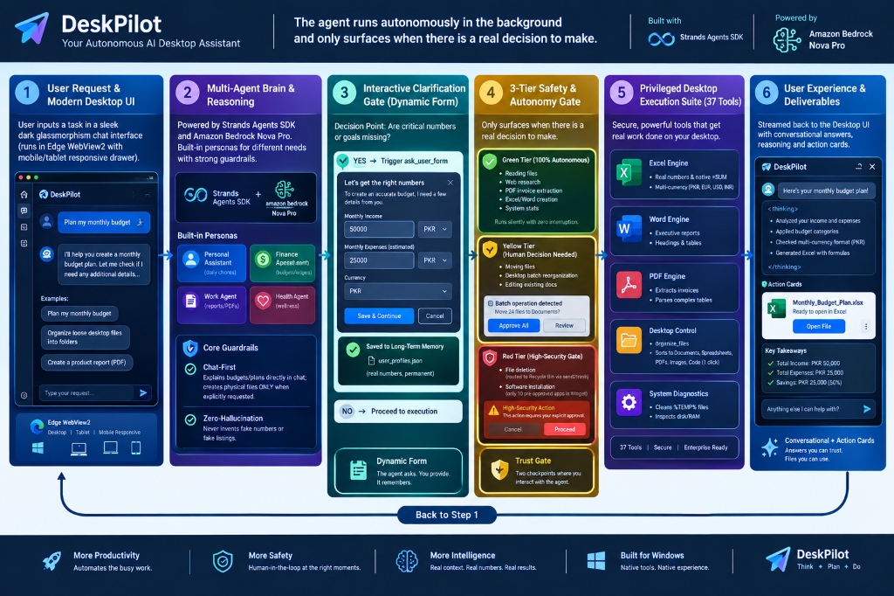
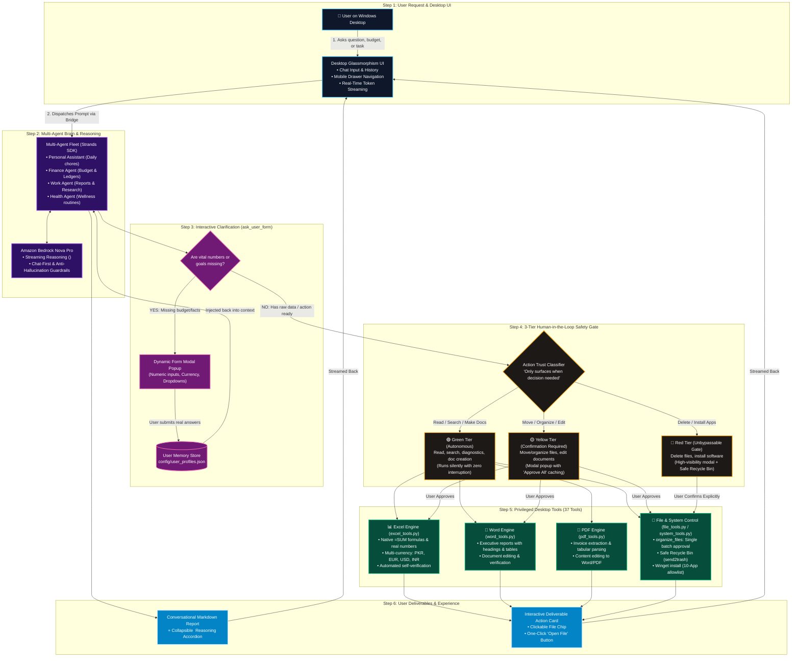
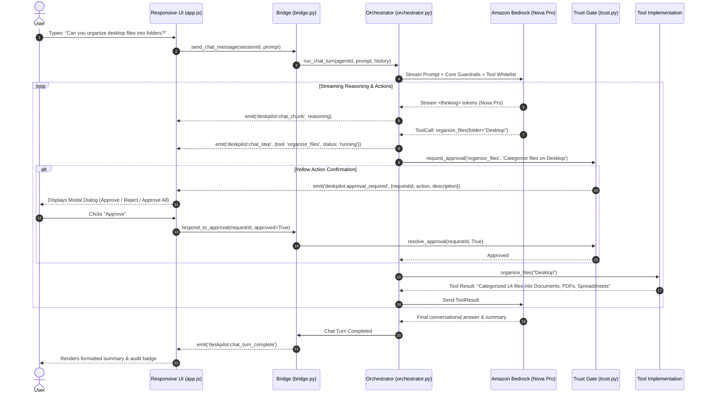
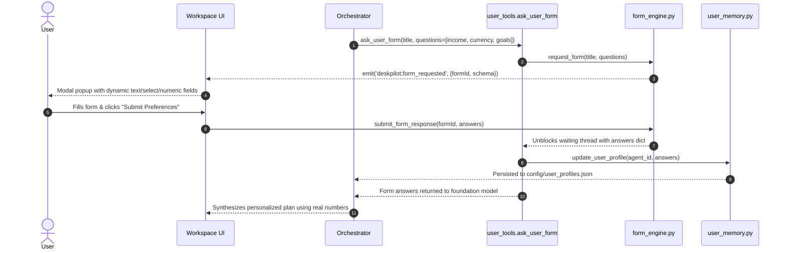
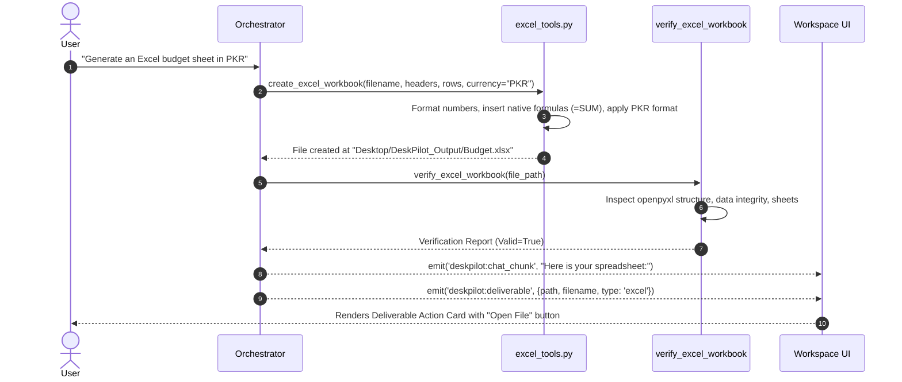

# DeskPilot — Technical Architecture & System Design

[](https://aws.amazon.com/bedrock/)
[](https://github.com/strands-agents)
[](https://pywebview.flowrl.com/)
[](../LICENSE)

DeskPilot is an enterprise-grade, autonomous multi-agent desktop workspace built for Windows. It couples cloud foundation model intelligence (**Amazon Bedrock Nova Pro**) with local operating system automation, office document processing, dynamic user memory, and an unbypassable 3-tier Human-in-the-Loop (HITL) safety framework.



---

## 1. High-Level Architecture Overview

DeskPilot is architected into five decoupled layers:

```
┌─────────────────────────────────────────────────────────────────────────┐
│                       1. PRESENTATION LAYER                             │
│   • Microsoft Edge WebView2 (pywebview)   • Browser Web Shell (Flask)   │
│   • Responsive Glassmorphism SPA (CSS Grid/Flex, Drawer Navigation)     │
│   • Live Streaming Chat with <thinking>   • Dynamic Modals & Forms      │
└────────────────────────────────────┬────────────────────────────────────┘
                                     │ Bidirectional RPC / Events
┌────────────────────────────────────▼────────────────────────────────────┐
│                         2. BRIDGE & API LAYER                           │
│   • DeskPilotBridge (Python Thread Pool)  • Flask REST & SSE Router     │
│   • Approval Event Synchronization        • Form Engine Synchronizer    │
└────────────────────────────────────┬────────────────────────────────────┘
                                     │ Invocation & Event Bus
┌────────────────────────────────────▼────────────────────────────────────┐
│                    3. AGENT ORCHESTRATION LAYER                         │
│   • Strands Agents SDK Runtime            • Amazon Bedrock Nova Pro     │
│   • Multi-Agent Registry (4 Personas)     • Dynamic Form Clarifier      │
│   • Chat-First Guardrails                 • Long-Term User Memory       │
└───────────────────┬─────────────────────────────────┬───────────────────┘
                    │ Tool Invocation                 │ Read / Write
┌───────────────────▼─────────────────┐   ┌───────────▼───────────────────┐
│   4. PRIVILEGED TOOL EXECUTION      │   │ 5. LOCAL STATE & PERSISTENCE  │
│   • 3-Tier Trust Gate (HITL Engine) │   │   • Chat History (chats/*.json│
│   • Document Suite (Word/Excel/PDF) │   │   • User Memory (profiles)    │
│   • Desktop Files & Recycle Bin     │   │   • Save Prefs & App Settings │
│   • Winget & System Diagnostics     │   │   • Audit Trail (logs/*.jsonl)│
└─────────────────────────────────────┘   └───────────────────────────────┘
```

---

## 2. Interactive System Topology (Mermaid)



---

## 3. End-to-End Runtime Execution Sequences

### 3.1. Chat-First Reasoning & Tool Execution Flow


---

### 3.2. Interactive User Onboarding & Dynamic Form Flow (`ask_user_form`)


---

### 3.3. Closed-Loop Office Deliverables Pipeline


---

## 4. 3-Tier Human-in-the-Loop (HITL) Safety Framework

DeskPilot enforces deterministic boundaries through `backend/utils/trust.py`:

| Tier | Policy | Execution Semantics | Tool Coverage |
|---|---|---|---|
| **🟢 Green** | **Autonomous** | Auto-executes immediately. Non-destructive operations, read-only sweeps, search, diagnostics, and new document generation. | `search_web`, `read_pdf`, `read_word_document`, `read_excel_file`, `create_word_report`, `create_excel_workbook`, `list_files`, `verify_file_exists`, `get_system_info`, `get_storage_status`, `ask_user_form`, `get_user_profile` |
| **🟡 Yellow** | **Confirmation Required** | Execution thread halts. UI presents interactive confirmation dialog. Supports **Approve All** turn caching for batch file actions. | `organize_files`, `move_file`, `rename_file`, `write_file`, `edit_word_document`, `edit_pdf_document`, `edit_excel_file`, `clean_temporary_files` |
| **🔴 Red** | **Unbypassable Approval** | Mandatory high-visibility warning dialog. Never auto-executes. Deletions route to safe Windows Recycle Bin via `send2trash`. Software installations validated against strict allowlist. | `delete_file`, `delete_files`, `winget_install` (validated against 10 allowlisted Windows applications), `run_shell_command` |

### Session-Scoped "Approve All" Caching
When a user approves a batch file move or document update with "Approve All", the approval engine adds the action name to `_approved_actions_cache`. Subsequent calls of that exact action within that turn succeed instantly without modal prompts, and the cache auto-resets when the next user turn starts.

---

## 5. Comprehensive Tool Library Taxonomy (37 Tools Across 7 Domains)

All tools are registered in `backend/tools/__init__.py` and mapped to `@tool` decorated functions:

### 1. Document Intelligence — Microsoft Word (4 Tools)
- `read_word_document(file_path)`: Reads paragraphs, tables, and document metadata.
- `edit_word_document(file_path, replacements, sections_to_add, output_path)`: Performs precise text replacements, appends formatted sections, and preserves styles.
- `create_word_report(title, sections, tables, output_path)`: Compiles professional `.docx` with executive formatting.
- `verify_word_document(file_path)`: Verifies file exists, can be parsed by `docx`, and is non-empty.

### 2. Document Intelligence — Microsoft Excel (5 Tools)
- `read_excel_file(file_path, sheet_name)`: Reads cell values, computed values, and sheet names.
- `edit_excel_file(file_path, sheet_name, cell_updates, append_rows)`: Modifies cells and appends real numeric data rows.
- `create_excel_workbook(filename, sheets_data, currency)`: Generates `.xlsx` with real numerical formats, currency styling (`PKR`, `EUR`, `USD`, `INR`), and native `=SUM()` formulas.
- `create_reconciliation_report(file_path_a, file_path_b)`: Performs row-by-row cross-ledger auditing.
- `verify_excel_workbook(file_path)`: Inspects workbook formulas and data using `openpyxl`.

### 3. Document Intelligence — Adobe PDF (5 Tools)
- `read_pdf(file_path, max_pages)`: Extracts high-fidelity text with `pypdf`.
- `edit_pdf_document(file_path, modification_instructions, output_format)`: Extracts content, applies intelligent changes, and exports to editable Word or PDF.
- `extract_pdf_tables(file_path)`: Extracts structured tables into tabular data.
- `extract_pdf_invoice(file_path)`: Extracts invoice numbers, dates, line items, and totals.
- `list_pdfs_in_folder(folder_path)`: Lists and indexes PDF files in any directory.

### 4. Desktop File Management & Safe Control (14 Tools)
- `list_files(directory, pattern)`: Lists directory contents with sizes and modification dates.
- `verify_file_exists(file_path)`: Validates file existence on disk.
- `move_file(source, destination)`: Relocates files safely.
- `rename_file(old_path, new_name)`: Renames files safely.
- `delete_file(file_path)`: Safely moves file to **Windows Recycle Bin** via `send2trash`.
- `delete_files(file_paths)`: Batch-sends files to Recycle Bin after single confirmation.
- `create_folder(folder_path)`: Creates directories recursively.
- `organize_files(folder_path)`: Categorizes loose files into subfolders (Documents, Spreadsheets, PDFs, Images, Code, Archives) with a single confirmation.
- `scan_and_categorize_files(folder_path)`: Pre-scans a directory without moving anything.
- `open_file(file_path)`: Launches file in default Windows application (`os.startfile`).
- `open_folder(folder_path)`: Reveals directory in Windows File Explorer.
- `get_file_info(file_path)`: Returns size, permissions, hashes, and dates.
- `explain_file_purpose(file_path)`: Inspects file headers to explain what a file is.
- `read_file` / `write_file`: General text file inspection and writing.

### 5. System Diagnostics & Package Management (8 Tools)
- `winget_install(package_id)`: Installs software via Windows Package Manager (`winget`) restricted to `WINGET_ALLOWLIST`.
- `get_winget_allowlist()`: Returns the approved software catalog (Firefox, Chrome, VS Code, Git, 7-Zip, Notepad++, VLC, Obsidian, Slack, Zoom).
- `check_software_installed(app_name)`: Checks registry and PATH for installed software.
- `launch_application(app_name)`: Launches approved desktop applications.
- `get_storage_status()`: Checks disk capacity and free space across all drives.
- `clean_temporary_files()`: Safely clears Windows user `%TEMP%` directory.
- `get_system_info()`: Reports CPU, RAM, OS version, and machine hostname.
- `get_running_processes(filter_name)`: Returns process list and memory utilization.

### 6. Web Intelligence (3 Tools)
- `search_web(query)`: High-speed web search with DuckDuckGo.
- `read_webpage(url)`: Fetches HTML and strips readable text with BeautifulSoup.
- `search_and_read(query)`: Combined search and content synthesis pipeline.

### 7. Dynamic User Memory & Dynamic Forms (3 Tools)
- `ask_user_form(title, questions)`: Opens a synchronous modal form in the UI to ask the user structured questions (text, number, select, textarea, checkbox).
- `get_user_profile(agent_id)`: Retrieves persisted user background and preferences.
- `update_user_profile(agent_id, updates)`: Updates long-term memory in `config/user_profiles.json`.

---

## 6. Multi-Agent Manifest Architecture

DeskPilot uses declarative JSON manifests (`agents/*.json`):

```json
{
  "id": "finance_agent",
  "name": "Finance Agent",
  "description": "Handles budgets, expenses, invoice extraction, and financial spreadsheets.",
  "icon": "circle-dollar-sign",
  "color": "emerald",
  "persona": "You are DeskPilot's Financial Assistant. You strictly format numbers, verify workbooks...",
  "allowed_tools": [
    "create_excel_workbook",
    "read_excel_file",
    "edit_excel_file",
    "verify_excel_workbook",
    "create_reconciliation_report",
    "extract_pdf_invoice",
    "ask_user_form",
    "get_user_profile"
  ],
  "category": "default",
  "status": "active"
}
```

### Manifest Fleet:
1. **Default Fleet**:
   - `personal_assistant`: General desktop productivity, organization, and light research.
   - `finance_agent`: Bookkeeping, spreadsheets, invoice extraction, and financial modeling.
   - `work_agent`: Executive reporting, multi-page business briefs, and PDF analysis.
   - `health_agent`: Wellness routines, nutrition planning, research (strict no-diagnosis safety guardrails).
2. **Template Fleet**:
   - `code_mentor`: Code reviews, refactoring, and debugging assistance.
   - `data_analyst`: Statistical analysis, CSV/Excel trend exploration, and visualization planning.
   - `travel_planner`: Itinerary creation, hotel comparison tables, and packing lists.
3. **Custom Agents**:
   - Created on the fly via `backend/agent/builder.py` using natural language prompts.
   - Foundation model automatically selects an authorized subset from `TOOL_REGISTRY`.

---

## 7. Responsive Client Shell & UI Design System

- **Desktop Shell**: Embedded Microsoft Edge Chromium engine via `pywebview` with custom window chrome and min-dimensions `420x500` for compact displays.
- **Web / Mobile Mode**: Served by Flask with Server-Sent Events (`/api/events/stream`).
- **Responsive Drawer Navigation**:
  - Desktop (>1024px): Persistent sidebar with session tree, agent switcher, and preferences.
  - Tablet/Mobile (<768px): Collapsible off-canvas drawer with hamburger toggle and backdrop overlay.
- **Modern Typography & Glassmorphism**: Tailored HSL dark palette (`#0a0d14`), translucent cards (`rgba(255,255,255,0.03)`), Lucide icons, and fluid `clamp()` responsive typography.
- **Collapsible Reasoning Accordions**: Captures Bedrock Nova Pro `<thinking>` tags in collapsible disclosure blocks so internal thought processes don't clutter executive summaries.

---

## 8. Directory & File Structure Mapping

```
DeskPilot/
├── agents/                       # Declarative JSON agent manifests
│   ├── personal_assistant.json
│   ├── finance_agent.json
│   ├── work_agent.json
│   └── health_agent.json
├── backend/                      # Python 3.12 Backend Architecture
│   ├── agent/                    # Strands Orchestrator, Builder, Registry
│   │   ├── builder.py            # Natural language agent synthesizer
│   │   ├── orchestrator.py       # Bedrock Converse API + Strands runner
│   │   └── registry.py           # Manifest storage & template manager
│   ├── chat/                     # Chat Session Management
│   │   └── session_manager.py    # Multi-turn chat persistence (chats/*.json)
│   ├── config/                   # Central Settings & Allow-lists
│   │   ├── settings.py           # AWS credentials, Trust Tiers, Winget list
│   │   └── user_profiles.json    # Long-term user memory database
│   ├── tools/                    # 37 Specialized Autonomous Tools
│   │   ├── __init__.py           # Canonical lookup & resolver
│   │   ├── excel_tools.py        # Excel creation, editing & verification
│   │   ├── file_tools.py         # File operations & safe send2trash
│   │   ├── pdf_tools.py          # PDF reading, editing & invoice extraction
│   │   ├── system_tools.py       # Winget installation & system stats
│   │   ├── user_tools.py         # Dynamic forms & user profile memory
│   │   ├── web_tools.py          # DuckDuckGo search & scraping
│   │   └── word_tools.py         # Word report creation & editing
│   ├── utils/                    # Infrastructure Utilities
│   │   ├── document_resolver.py  # Universal path & output resolver
│   │   ├── form_engine.py        # Synchronous modal form engine
│   │   ├── logger.py             # JSONL structured audit logging
│   │   ├── trust.py              # 3-tier HITL safety gate
│   │   └── user_memory.py        # User memory context injector
│   ├── app.py                    # pywebview desktop entrypoint
│   ├── bridge.py                 # JavaScript ↔ Python two-way bridge
│   └── server.py                 # Flask REST API + SSE stream
├── config/                       # Runtime persistent configuration
├── docs/                         # Technical Architecture & Deployment Specs
│   ├── ARCHITECTURE.md           # This document
│   └── DEPLOYMENT.md             # AWS & local deployment manual
├── frontend/                     # Presentation Layer (Vanilla SPA)
│   ├── css/styles.css            # Dark glassmorphism stylesheet
│   ├── js/app.js                 # Workspace UI controller & stream handler
│   ├── js/bridge.js              # Dual-mode desktop/HTTP transport
│   └── index.html                # HTML5 semantic structure
├── installer/                    # Inno Setup 6 Windows packaging script
├── logs/                         # Runtime JSONL audit trails
├── main.py                       # Root launcher (desktop or web mode)
└── tests/                        # Pytest automated test suite (42 unit tests)
```
